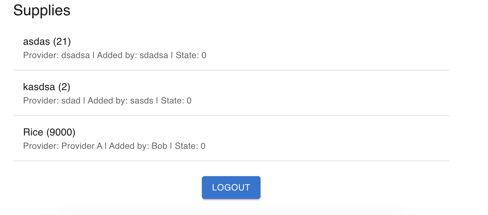

# Supply Chain DApp
A full-stack decentralized application (DApp) for supply chain management.

<div align="center">
  
  
  
  
  
  
  
  
  
  
  
</div>

### 🔐 Login


### 📊 Dashboard


### 📊 Table



# 🚀 Setup Instructions

### 1️⃣ Backend (NestJS)
```bash
cd nestjs
nvm use 20
npm install
npm run start:dev
http://localhost:3001
```
### .env
```php
PORT=3001
JWT_SECRET=your_jwt_secret
WEB3_PROVIDER=http://localhost:8545
CONTRACT_ADDRESS=deployed_contract_address_here
```


### 2️⃣ Frontend (NextJS)
```bash
cd nextjs
nvm use 20
npm install
npm run dev0
http://localhost:3000
```
### .env
```php
NEXT_PUBLIC_API_URL=http://localhost:3000
NEXT_PUBLIC_WEB3_PROVIDER=http://localhost:8545
NEXT_PUBLIC_CONTRACT_ADDRESS=deployed_contract_address_here
```

### Smart Contracts (Hardhat)
```bash
cd smart-contracts
nvm use 20
npm install

npx hardhat compile
npx hardhat run scripts/deploy.ts --network localhost

npx hardhat test
```

### Run servers
```bash
cd smart-contracts
npx hardhat node

brew services start redis
```

### Features
✅ JWT-based authentication
✅ Next.js + MUI 5 UI  
✅ Web3.js + Ethers.js integration to interact with smart contracts  
✅ Modular backend (NestJS v11) and frontend (Next.js 14 App Router)  
✅ Solidity smart contracts with event emitters for off-chain listening  
✅ Fully unit tested smart contracts (Hardhat + Mocha + Chai)  
✅ Scalable Redis caching layer to reduce blockchain reads and improve performance  
✅ Loading states, optimistic UI, and user-friendly error handling in frontend  
✅ Clean architecture ready for scaling to testnet/mainnet  
