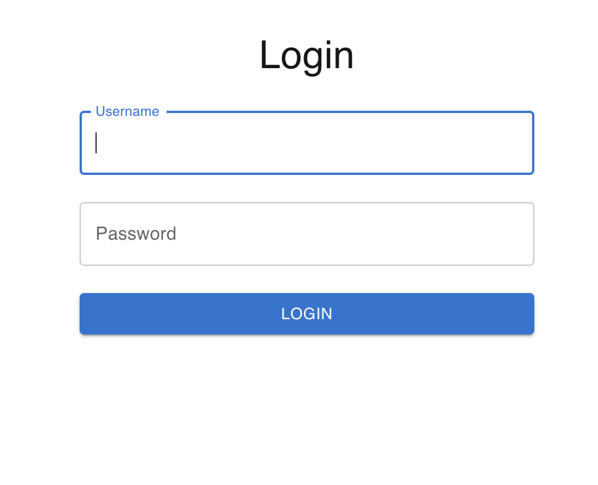
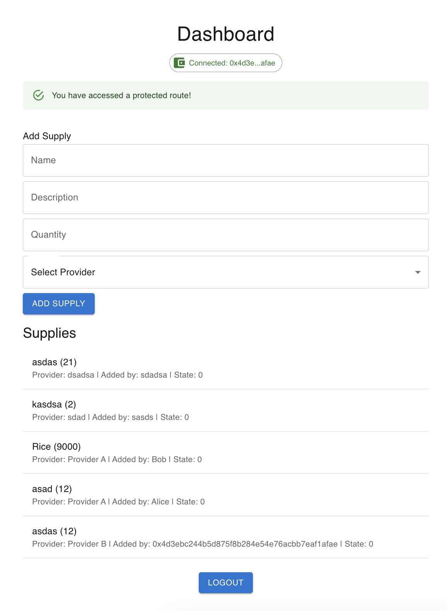
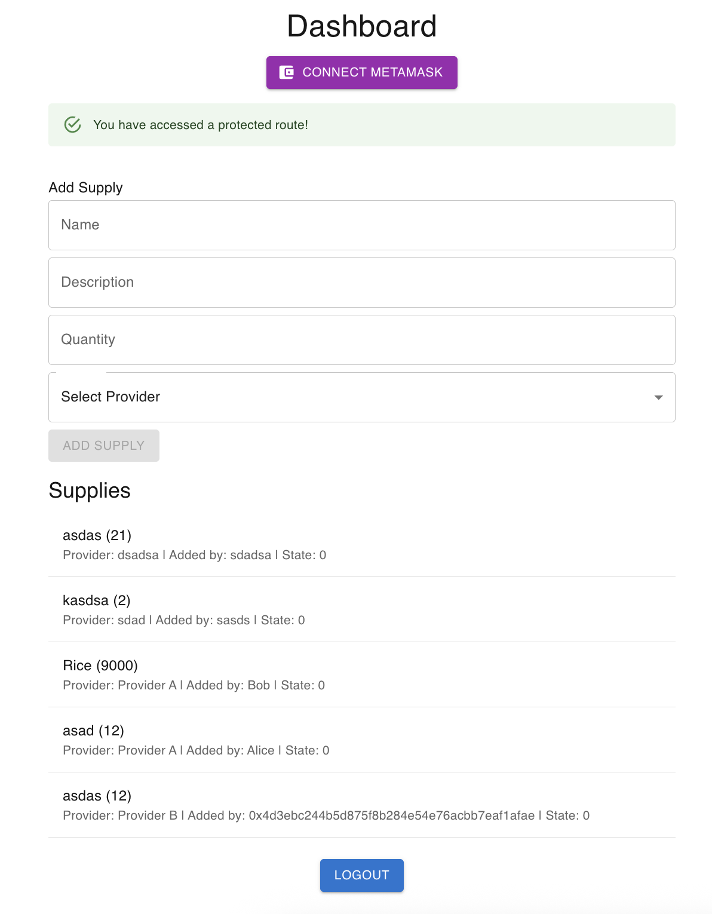

# Food Supply DApp
A full-stack decentralized application (DApp) for food supply management.

### Frontend
<div>
  
  
  
</div>

### Backend
<div>
  
  
</div>

### Smart Contracts
<div>
  
  
  
  
</div>

### For all
<div>
  
  
  
  
</div>


### 🔐 Login


### 📊 Dashboard




# 🚀 Setup Instructions

### Backend (NestJS)
```bash
cd nestjs
nvm use 20
npm install
npm run start:dev
http://localhost:3001
```

Server will run at:
http://localhost:3001

.env
```env
PORT=3001
JWT_SECRET=your_jwt_secret
WEB3_PROVIDER=http://localhost:8545
CONTRACT_ADDRESS=deployed_contract_address_here
```


### Frontend (NextJS)
```bash
cd nextjs
nvm use 20
npm install
npm run dev
```

Server will run at:
http://localhost:3000

.env
```env
NEXT_PUBLIC_API_URL=http://localhost:3000
NEXT_PUBLIC_WEB3_PROVIDER=http://localhost:8545
NEXT_PUBLIC_CONTRACT_ADDRESS=deployed_contract_address_here
```

### Smart Contracts (Hardhat)
```bash
cd smart-contracts
nvm use 20
npm install

npx hardhat compile
npx hardhat run scripts/deploy.ts --network localhost

npx hardhat test
```

### Run local blockchain
```bash
cd smart-contracts
npx hardhat node
```

### Run Redis
```bash
brew services start redis
```

Server will run at:
http://localhost:6379

| Feature |
|---------|
| ✅ JWT-based authentication |
| ✅ Next.js + MUI 5 UI |
| ✅ Web3.js + Ethers.js integration to interact with smart contracts |
| ✅ Modular backend (NestJS v11) and frontend (Next.js 14 App Router) |
| ✅ Solidity smart contracts with event emitters for off-chain listening |
| ✅ Fully unit tested smart contracts (Hardhat + Mocha + Chai) |
| ✅ Scalable Redis caching layer to reduce blockchain reads and improve performance |
| ✅ Loading states, optimistic UI, and user-friendly error handling in frontend |
| ✅ Clean architecture ready for scaling to testnet/mainnet |
